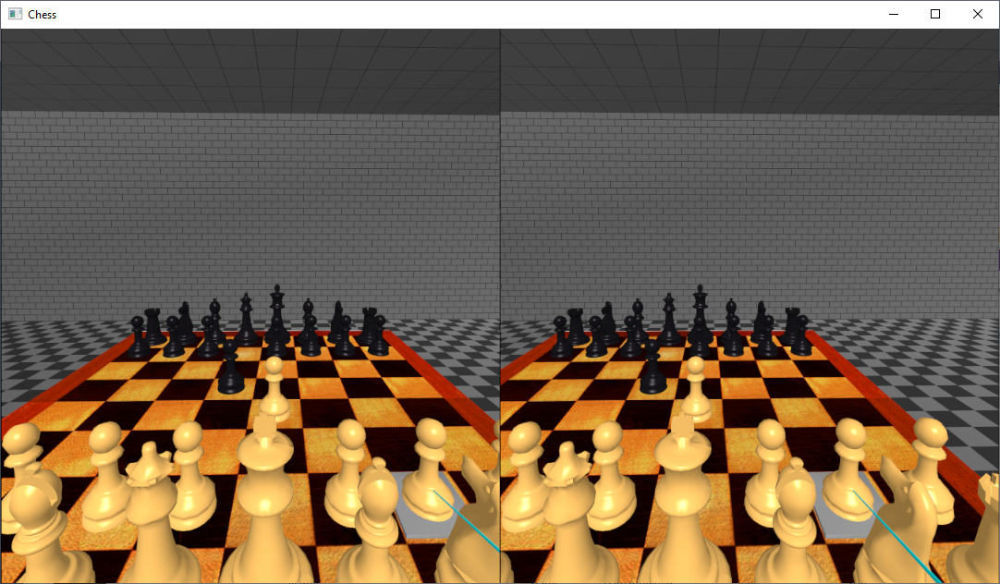

This is an Oculus Rift program to play Chess in VR.

# Usage
Use the right-handed touch controller to pick squares and pieces.  Click the trigger to pick a piece to move, and click the trigger on a target square.  You play white, the compute plays black.
You can use wasd to move the camera location around.

# Compiling

Install the Oculus Rift SDK and ensure that you set the OVRSDKROOT env var.

The project is set to build in VS2019.  Load the VRChess.sln file